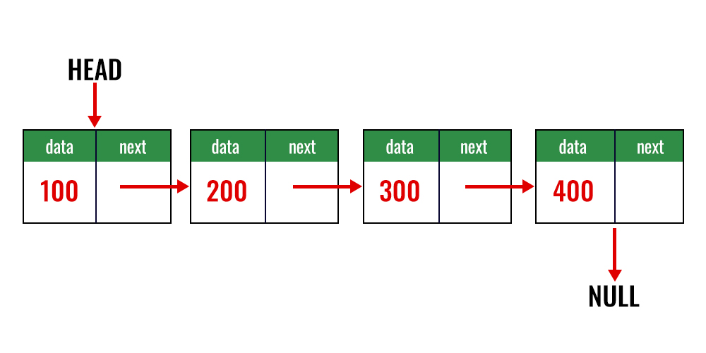

# problem with Array Data Structure 
1. Fixed Size problems(either size is fixed or pre allocated, it was fixed by arraylist in java, they double the size)
issue with array list-> you need to copy all n elements from array one to array2 when it's full Big(n)
2. Insertion in middle or beginning is costly (all element need to shift right)
3. Deletion in middle or beginning is costly (all element need to shift right)
4. Complex implementation of other data structures using Arrays
5. If in a system programming you do not have contiguous space but have fragement spaces then linkedlist is the solution becuase linkedlist use fragement spaces although it's sequentail DS



## Linkedlist

It's a sequentail DS but node contains the references of the next node. The idea is to drop the contiguous memory requirements so that insertion, deletion can happen  at the middle also 
and no need to preallocate the spaces, LL is stored in heap.


Simple linkedList implementation

```java
public class Simple_LinkedList_Implementation {
    public static void main(String[] args) {
        Node head = new Node(10);
        Node twenty = new Node(20);
        Node thirty = new Node(30);
        
        //linking 
        head.nextNode = twenty;
        twenty.nextNode = thirty;
    }
}
class Node{
    int data;
    Node nextNode;
    public Node(int data){
        this.data = data;
        nextNode = null;  // this line is optional if you don't initialize it will default be null
    }
}
```


# Application of LinkedList

- worst case insertion at the beginning and end are constant time 0(1)
- worst case deletion at the beginning is constant time 0(1)
- insertion, deletion in the middle is constatnt time if we have the reference of previous node(double linkedList)
- round robin implementation (process allocation)
- merging two sorted linkedlist is faster then arraylist
- implementation of simple memory manager where we need to link free blocks 
- easier implementation of queue and deque then arraylist 


# LinkedList Traversal
```java
    public static void traversal(Node head) {
        Node curr = head;
        while (curr != null) {
            System.out.println(curr.data);
            curr = curr.nextNode;
        }
    }

    public static void recursiveTraversalSinglyLL(Node head) {
        //note always check head condititon for null not on head.nextNode , otherwise you will lose the last element
        if (!(head == null)) {
            System.out.println(head.data);
            recursiveTraversal(head.nextNode);
        }
    }

public static Node insertionBeginningSinglyLL(Node head, int n){
        Node tmp = new Node(n);
        tmp.nextNode = head;
        return tmp;
        }

public static Node insertionEndSinglyLL(Node head, int n) {
        Node tmp = new Node(n);
        if (head == null) {
        head = tmp;
        }
        Node curr = head;

        //go to the end node
        while (curr.nextNode != null) {
        curr = curr.nextNode;
        }
        curr.nextNode = tmp;
        tmp.nextNode = null;
        return head;
        }
        
        // good question below 

public static Node insertionAtPosition(Node head, int pos, int n) {
        Node tmp = new Node(n);

        //if we just have
        if(head.nextNode == null){
        head.nextNode = tmp;
        }
        Node curr = head;
        //go to the end node
        for (int i = 0; i < pos-2 && curr !=null; i++) {
        curr = curr.nextNode;
        if(curr==null){
        return head;
        }
        }
        tmp.nextNode = curr.nextNode;
        curr.nextNode = tmp;
        return head;
        }
```

## Deleting 
```java

    public static Node deleteFirstNode(Node head) {
        //if there's only one head node then head.nextNode would be null returned
        if (head == null) {
            return null;
        }
        return head.nextNode;

    }

    public static Node deleteLastNode(Node head) {
        if (head == null || head.nextNode == null) {
            return null;
        }
        Node curr = head;
        while (curr.nextNode.nextNode != null) { // you need to stop at the 2nd last node
            curr = curr.nextNode;
        }
        curr.nextNode = null;

        return head;

    }
    
    
    //Searching in LL 

    public static int searchLinkedListPosition(Node head, int x){
            int position = 1;
            Node curr = head; // always use a temp Node 
            while (curr != null){  // always remeebr to use curr != null not curr.nextNode != null
            if(curr.data == x)
            return position;
            curr = curr.nextNode;
            position++;
            }
            return -1;

            }
```

